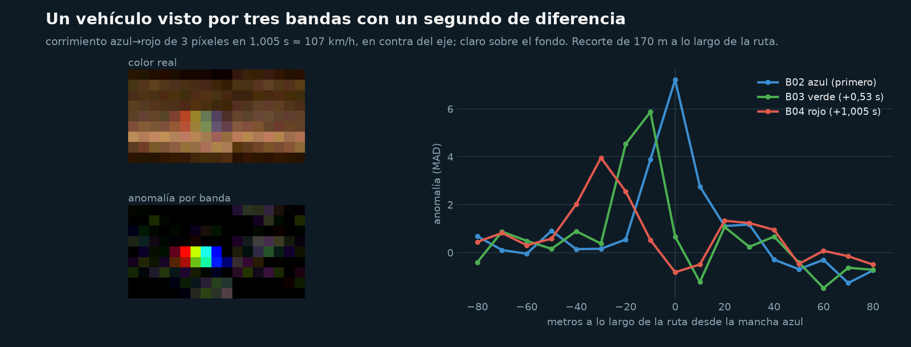
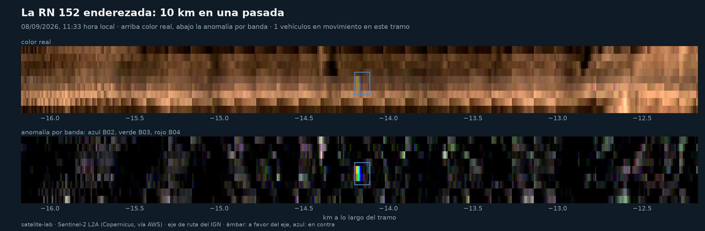
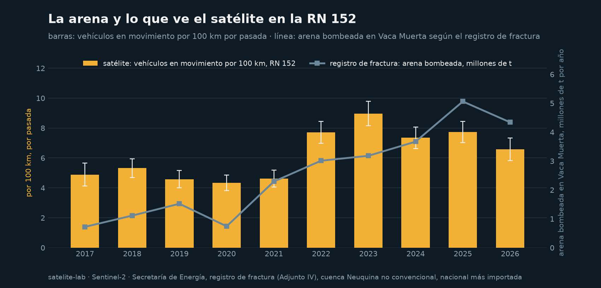
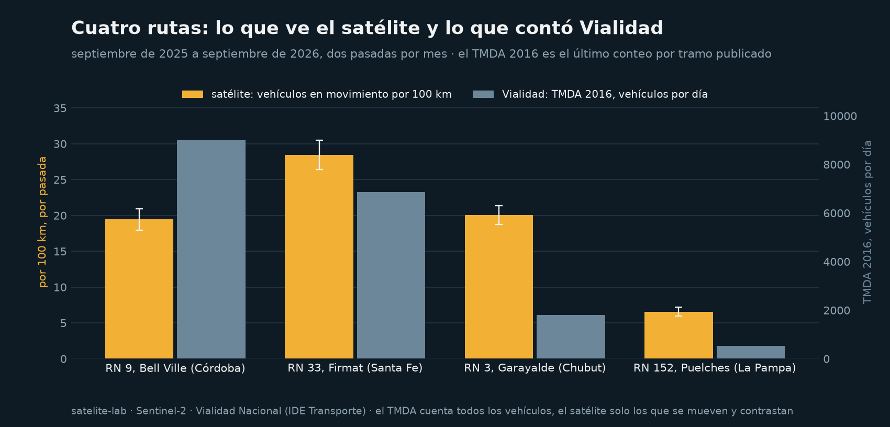

# satelite-lab

El satélite cuenta camiones. Sentinel-2 toma cada banda con una fracción de
segundo de diferencia, y en ese lapso un vehículo a 80 km/h se mueve dos
píxeles: queda en la imagen como una mancha azul, una verde y una roja
corridas en el sentido de marcha. Este repo usa ese defecto como instrumento
para contar vehículos en movimiento sobre una ruta, con su sentido y una
velocidad aproximada, en cualquier fecha despejada desde 2017. Noveno repo de
la serie Sur Analytics y el tercero de logística, después del mapa del vacío.

> La matriz de cargas del Estado termina en 2018 y Vialidad no publica
> conteos por tramo desde 2017. El satélite pasa cada tres días, es gratis
> y no le pregunta a nadie. No ve todos los vehículos, pero ve una muestra
> con el mismo método en cualquier ruta y cualquier año: sirve para comparar.



## Qué hace

| Notebook | Qué hace |
|---|---|
| `01_el_satelite_cuenta_camiones` | Endereza la RN 152 (la ruta de la arena, al sur de Puelches) a partir del eje del IGN, busca los arcoíris en una pasada de septiembre de 2026, mide corrimiento y sentido, y cuenta. Después repite la cuenta en todas las pasadas de días hábiles desde 2017 y la compara con la arena bombeada en Vaca Muerta según el registro de fractura. Por último, un año de pasadas sobre cuatro rutas contra el último conteo por tramo de Vialidad. |

Las funciones están en `src/slab/`: `roads.py` trae la red vial nacional del
IGN y da la posición a lo largo de la ruta; `scenes.py` busca escenas en el
catálogo abierto de AWS y lee la ruta enderezada por ventana, sin bajar la
escena; `detect.py` es el detector; `counts.py` pasa de detecciones a densidad
y series; `figures.py` dibuja. `scripts/run_series.py` corre el detector
sobre todas las pasadas de una ruta y es reanudable. Todo testeado con
franjas sintéticas; el notebook narra.

## Cómo funciona

El instrumento MSI de Sentinel-2 toma el azul (B02) primero, el verde (B03)
0,527 s después y el rojo (B04) 0,478 s más tarde: 1,005 s entre el primero
y el último. Un vehículo que avanza 20 m en ese segundo (72 km/h) aparece
en el azul en un píxel, en el verde en el siguiente y en el rojo dos más
allá. Un techo o un cartel, que no se mueven, son anómalos en las tres
bandas en el mismo lugar.

El detector trabaja sobre la ruta enderezada: se muestrea cada 10 m a lo
largo del eje del IGN y ±40 m a lo ancho (±80 m en autopista), y queda una
franja por banda. El
fondo es la mediana móvil a lo largo de la ruta, carril por carril; la
anomalía se mide en unidades de dispersión robusta. Donde el azul es anómalo
se buscan los perfiles de las tres bandas a lo largo y el corrimiento que
mejor alinea el rojo con el azul, por correlación cruzada. Corrimiento cero:
objeto fijo. Dos o tres píxeles: algo que se mueve entre 54 y 125 km/h. El
verde tiene que caer entre los dos, y la suma de anomalías sobre la
trayectoria tiene que superar a la del mismo lugar. El signo del corrimiento
da el sentido, porque el azul se toma primero. Las detecciones llevan
confianza alta (firma fuerte y bien alineada) o media.

Es una versión propia del principio de Fisser et al. (2022), que clasifican
píxeles con un bosque aleatorio entrenado a mano. Acá la regla es explícita y
usa la geometría de la ruta; no hay entrenamiento.

## Qué encontramos

**El efecto está y se ve a ojo.** En la RN 152 al sur de Puelches, un martes
de septiembre de 2026 a las 11:33, el detector encuentra tres vehículos en
65 km. El mejor es un arcoíris de libro: azul, verde y rojo en píxeles
consecutivos, corridos 30 m en un segundo, 107 km/h hacia el noreste.



**El satélite ve una muestra, no el total.** Vialidad contó 520 vehículos
por día en ese tramo en 2016, antes de la arena; arena-lab y vacio-lab
estiman entre 900 y 1.300 camiones por día en 2025. Tres vehículos en 65 km
a media mañana serían unos 90 por día si todos fueran a 80 km/h. Un píxel
son 100 m²: solo los vehículos que contrastan con la ruta y van rápido dejan
un arcoíris limpio. Por eso el número que se publica es un índice, vehículos
en movimiento por 100 km por pasada, y lo que vale es la comparación con el
mismo método.

**La ruta de la arena, 2017 a 2026.** 213 pasadas de días hábiles sin
nubes, dos por mes, sobre los mismos 70 km. El índice está quieto entre 4,3
y 5,3 vehículos por 100 km de 2017 a 2021, salta a 7,7 en 2022 y a 9,0 en
2023, y queda entre 6,6 y 7,7 desde entonces. La arena bombeada en Vaca
Muerta, según el registro de fractura, pasó de 0,7 millones de toneladas en
2017 a 3,2 en 2023 y 5,1 en 2025. La correlación entre los dos es 0,76
(0,72 en rangos): el satélite ve el cambio de escala de la ruta de la arena.
Lo que no ve es el salto de 2025. Puede ser que el índice se sature, que
parte de la arena nueva venga de Allen y no pase por acá, o las dos cosas;
con estos datos no se puede separar.



**Cuatro rutas contra Vialidad.** Un año de pasadas (septiembre de 2025 a
septiembre de 2026) sobre la RN 33 del grano en Firmat (28 vehículos por
100 km), la RN 3 patagónica en Garayalde (20), la autopista Rosario-Córdoba
en Bell Ville (19) y la RN 152 (7). Vialidad contó en esos tramos, en 2016,
6.850, 1.800, 9.000 y 520 vehículos por día. El orden no coincide: la RN 3
aparece con tanto como la autopista con una quinta parte del tránsito. El
satélite ve sobre todo lo grande y rápido, y en la RN 3 casi todo lo que
circula es camión; en la autopista, la mayoría son autos. En la autopista la
franja se ensancha a ±80 m para cubrir las dos calzadas: con ±40 m se
perdía entre un 20 y un 50 % de las detecciones.



## Limitaciones

- **Recuperación baja y no medida.** El satélite ve una fracción de los
  vehículos; cuál, no está medido. El índice sirve para comparar rutas y
  años, no para decir cuántos camiones pasan por día.
- **No distingue camión de auto.** La velocidad ayuda (los camiones van a 80,
  no a 110) y la amplitud también, pero no alcanzan para separar.
- **Una foto a media mañana.** Todas las pasadas son entre las 10:30 y las
  11:30 hora local. Pasar de densidad a vehículos por día exige una velocidad
  y un perfil horario que se declaran y no se miden.
- **Dos y tres píxeles.** La velocidad sale en escalones de 36 km/h; el
  corrimiento de un píxel es ambiguo y se descarta, así que lo que va a menos
  de 54 km/h no cuenta.
- **El eje del IGN.** El sentido depende de que la línea esté bien orientada
  en cada tramo; en la RN 152 quedó a menos de un píxel del asfalto, en
  otras rutas no se verificó tramo por tramo.
- **Nubes y bordes.** Escenas con menos de 5 % de nubes y máscara de escena
  por píxel; lo tapado no cuenta y el kilometraje válido lo dice.

## Cómo correrlo

```
python -m venv .venv
.venv\Scripts\python.exe -m pip install -r requirements.txt
.venv\Scripts\python.exe -m ipykernel install --user --name satelite-lab --display-name "satelite-lab"
.venv\Scripts\python.exe scripts/download_data.py
.venv\Scripts\python.exe -m pytest -q tests
.venv\Scripts\python.exe scripts/run_series.py 152 2017-01-01 2026-09-23 --por-mes 2
.venv\Scripts\python.exe -m jupyter nbconvert --to notebook --execute --inplace notebooks/01_el_satelite_cuenta_camiones.ipynb
```

No hace falta cuenta ni clave: las imágenes se leen por ventana desde el
catálogo STAC de Element 84 en AWS. Una pasada sobre 70 km tarda entre 40 y
70 segundos; la serie completa de la RN 152, unas dos horas. En Linux, en
lugar de `.venv\Scripts\python.exe`, `.venv/bin/python`.

## Datos y licencias

- Sentinel-2 L2A, Copernicus (ESA), datos abiertos bajo la licencia de
  Copernicus; servidos como COG por Element 84 en AWS Open Data:
  <https://earth-search.aws.element84.com/v1>
- Instituto Geográfico Nacional, red vial nacional (`ign:vial_nacional`, WFS):
  <https://www.ign.gob.ar/>
- Vialidad Nacional, TMDA 2016 por tramo, vía IDE Transporte:
  <https://ide.transporte.gob.ar/geoserver>
- Secretaría de Energía, registro de fractura (Adjunto IV), para la arena
  por año, por medio de vacio-lab.
- Desfases entre bandas: Binet et al., citados en el dataset europeo de
  velocidades con Sentinel-2 (arXiv 2608.22116, 2026). Método de referencia:
  Fisser, Khorsandi, Wegmann y Baier (2022), *Detecting Moving Trucks on
  Roads Using Sentinel-2 Data*, Remote Sensing 14(7):1595.

Código con licencia MIT.

## Autor

Diego Piñero, Sur Analytics.
